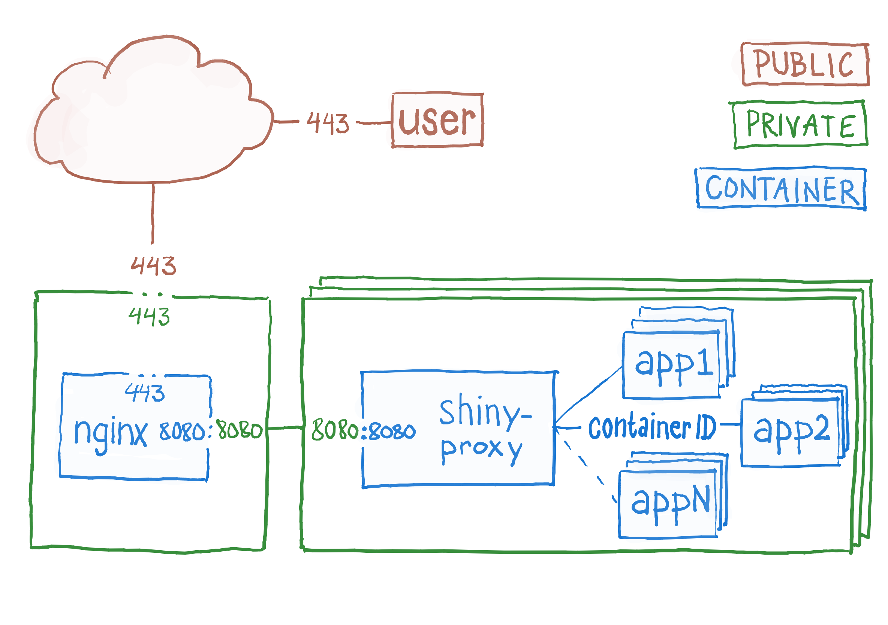

# Mongr load balancer and reverse proxy

Adjusted with our own flavour, but mostly by re-using existing and excellent [code](https://github.com/wmnnd/nginx-certbot) and [step-by-step guide](https://medium.com/@pentacent/nginx-and-lets-encrypt-with-docker-in-less-than-5-minutes-b4b8a60d3a71)

## Introduction
The name _lb-rp_ is a condenced form of _load blancer - reverse proxy_ and is part of the infrastructure hosting web application developed and mentained by _SKDE_. _lb-rp_ is based on [NGINX Open Source](https://www.nginx.com/) and applied as a docker container alongside our config and other cogs that make up [mongr.no](https://mongr.no):

## Installation
Text-to-be...

## Updates
Text-to-be...
